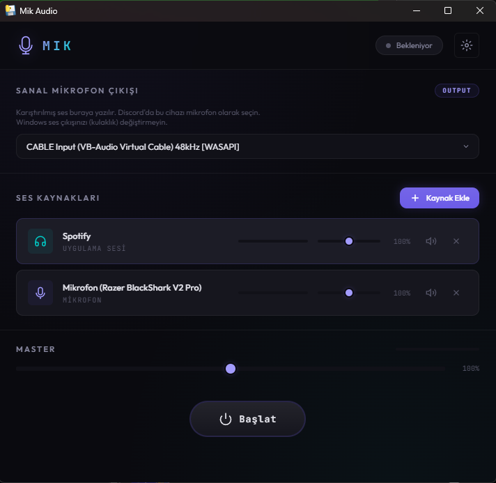

<p align="center">
  
</p>

<h1 align="center">CommonMik</h1>

<p align="center">
  Per-application audio mixer for Windows
  <br/>
  <a href="README_TR.md">🇹🇷 Türkçe</a>
</p>

---

Capture audio from specific apps (Spotify, Chrome, games), mix with your microphone, and output to a virtual microphone for Discord, Zoom, or any voice chat.

## Features

- **Per-app audio capture** — Select exactly which applications to capture using WASAPI Process Loopback (Windows 10 2004+)
- **Microphone mixing** — Combine your mic input with app audio into a single virtual microphone output
- **Independent volume controls** — Adjust each source separately with real-time level meters
- **Virtual microphone output** — Routes mixed audio through VB-Audio Virtual Cable
- **WASAPI exclusive mode** — Native 48kHz pipeline, zero resampling when using WASAPI devices
- **Sinc resampling** — High-quality polyphase FIR resampling when sample rates differ
- **System tray** — Minimize to tray, keeps running in background
- **Auto-save settings** — Output device, sources, volumes, mute states persist across sessions
- **Multi-language** — English and Turkish UI
- **Native Windows app** — Uses WebView2 (Edge Chromium), no browser dependency
- **Dark theme UI** — Glassmorphism design with real-time audio meters

## How It Works

```
Spotify  ───────┐
Chrome   ───────┤──→  CommonMik  ──→  CABLE Input  ──→  Discord mic input
Your mic ───────┘      (mixer)        (virtual cable)    (CABLE Output)
```

Windows audio output stays on your headphones — CommonMik captures app audio via WASAPI Process Loopback without redirecting system output.

## Requirements

- Windows 10 version 2004+ / Windows 11
- [VB-Audio Virtual Cable](https://vb-audio.com/Cable/) (free)

## Installation

### Pre-built (Recommended)

1. Download the latest release from [Releases](https://github.com/egeorcun/CommonMik/releases)
2. Install [VB-Audio Virtual Cable](https://vb-audio.com/Cable/)
3. Run `CommonMik.exe`

### From Source

```bash
git clone https://github.com/egeorcun/CommonMik.git
cd CommonMik
pip install -r requirements.txt
python main.py
```

### Build Executable

```bash
pip install -r requirements.txt
pyinstaller build.spec
# Output: dist/CommonMik/CommonMik.exe
```

## Usage

1. **Select output device** — Choose `CABLE Input (VB-Audio Virtual Cable) [WASAPI]`
2. **Add sources** — Click ➕ to add your microphone and/or application audio
3. **Start engine** — Click the Start button
4. **In Discord** — Set your input device to `CABLE Output (VB-Audio Virtual Cable)`

### Tips

- Keep all volumes at **100%** for cleanest signal — adjust at source (Spotify) or destination (Discord)
- Always select **WASAPI** devices for lowest latency and best quality
- Close the window to minimize to system tray — right-click tray icon to quit

## Architecture

```
core/
  audio_engine.py  — AudioFIFO ring buffer, AudioSource, AudioEngine mixer
  loopback.py      — WASAPI Process Loopback via ActivateAudioInterfaceAsync
ui/
  index.html       — Main UI layout
  style.css        — Dark glassmorphism theme
  app.js           — Frontend controller (pywebview JS API bridge)
main.py            — pywebview window + system tray + Python↔JS API
```

## License

MIT
